# Analyzing employee's information who will retire in the upcoming years from Pewlett-Hackard

## Overview

Pewlett-Hackard is preparing for the retirement of several of their employees. 
First it's offering retiriment packages for those who meet certain criteria and second it's preparing for filling the positions of the employees who will retire. 
We will be working with an HR Analyst who's task is to perform employee research. He needs to find answers for the following questions:

1. Who will be retiring in the next few years?
2. How many positions does the company need to fill?

We'll be working with CSV files exploring their data with SQL and generating a list of all employees elegible for retirement.

## Results

* The first task was to filter all the company employee's data to only retrieve those who were born between 1952 and 1955 and store them in a table named __retirement_titles__. These employees are elegibles for retirement.

    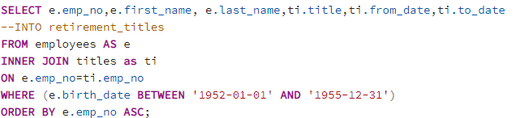

    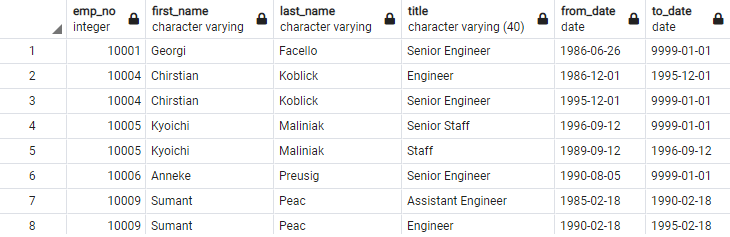

* Then, from the information obtained above we have current and old employees, therefore we have filter only the current employees and store them in a table named __unique_titles__.

    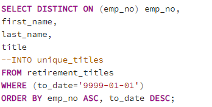

    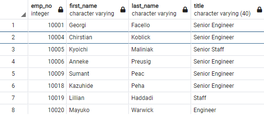

* Once we have the current employees who're elegibles for retirement, we need to know the amount of employees per title to have a better idea of how many will retire.

    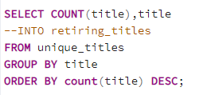

    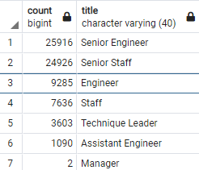

* Finally, since the company wants to keep some of their employees who will be retiring as mentors for new employees they want to know who are elegibles for this part-time job. The criteria is that mentors were born between January 1, 1965 and December 31, 1965.

    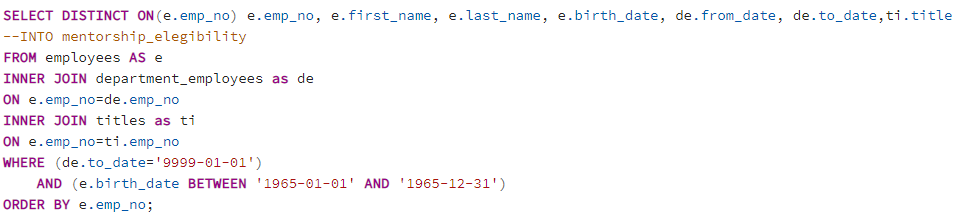

    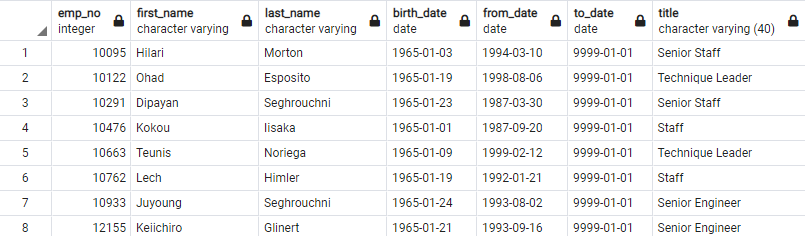

## Summary

### * How many roles will need to be filled as the "silver tsunami" begins to make an impact?

A total of 72,458 roles will need to be filled in the upcoming years, the 70% belongs to Seniors Engineers and Staff positions. Because of the amount of these roles, the HR department should give priority to filling these positions. 
The rest of positions like Engineer, Staff, Technique Leader, Assitant Engineer and Manager are important to fill, but they won't be as urgent as Senior Engineers and Senior Staff. 
To have a better understanding of the HR department capacity to look for candidates, we can perform a query to retrieve all the current HR employees and see what measures could be taken to succeed in the task.

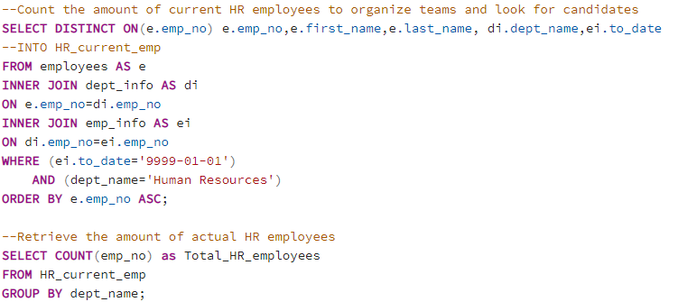

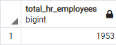

- We could see that there're 1,953 HR employees. 
A recommendation could be to divide the HR department in teams to look for candidates and the size of these teams will depend on the quantity of positions to fill. The department will have to set up goals regarding time and quantity of candidates to hire in order to succeed in the task.

### * Are there enough qualified, retirement-ready employees in the departments to mentor the next generation of Pewlett Hackard employees?

To have more insight about this, we could make another query to know the amount of employees and their respective rolls who're elegible for mentorship. We'll store this information in a tabe named __mentorship_per_title_table__.

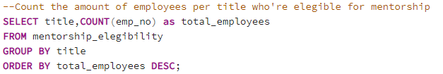

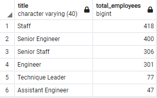

And then we proceed to compare the retiring_titles_table (left) vs mentorship_per_title_table (right).

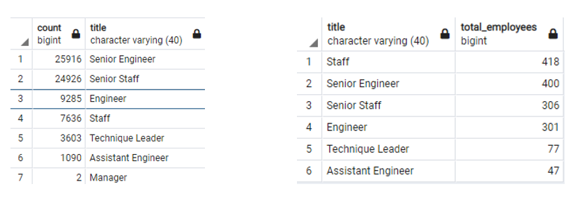

- From this we can see that there's not enough Senior Engineer and Senior Staff elegibles for mentorship since the mentorship amount represent  1.5% and 1.2%, respectively , from the roles to be filled. We have to considerar that the total of roles in the retiring_titles_table must be filled and the amount represented in the mentorship_per_title_table could not be hired at all. 

- Due there's no managers elegibles for mentorship, an option could be that current managers mentor the ones who need to cover those roles.

